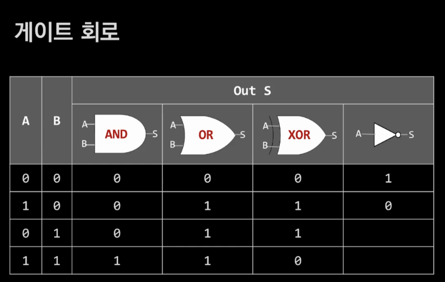
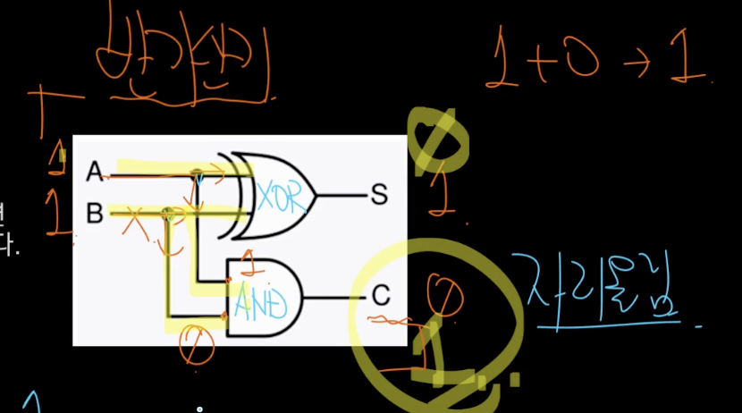
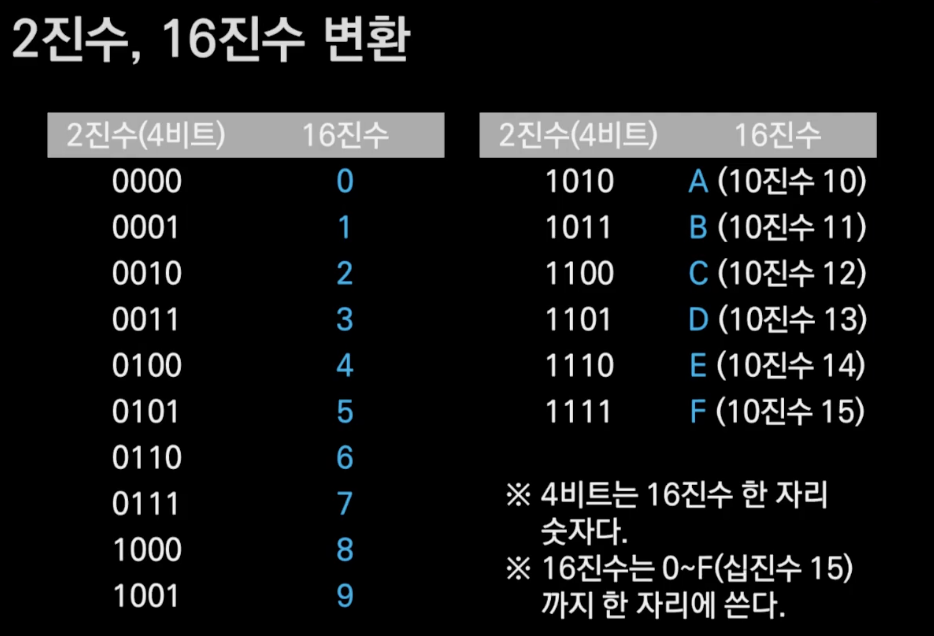

# 디지털 세계

생성일: December 9, 2023 10:01 PM
상의 그룹: C언어

## 내용

### 컴퓨터와 2진법

- 1bit는 전기 스위치 1개를 의미
- 스위치가 On 상태는 1, 흐르지 않는 Off
- 여러 스위치(혹은 전선)를 4개씩 묶어주면 4bit
    - 2^4 = 16

### 게이트 회로

### 컴퓨터가 덧셈 하는 방법

- 2진수 1 + 1 은 진수 10
- A가 1, B가 1이면 XOR 연산결과 S는 0이다
- 동시에 A가 1, B가 1이면 AND 연산결과 C는 1이다.
    - 이 1은 자리 올림(Carry)이다

### 2진수, 16진수 변환

OxF → 4bit

Ox3F → 8bit 

### 16진수(저수준) 표기가 사용되는 예

- 생상 표현(RGB 컬러)
- 컴퓨터 하드웨어 주소 표현
- 메모리에 저장된 값 표현

### 실행이란?

- 실행의 실체는 CPU 연산
- 연산에 필요한 정보는 **메모리에서 가져와야 함**
- 메모리에서 **CPU 레지스터로 전달된 후 연산**
- 연산 결과가 저장된 **레지스터 값을 다시 메모리로 보내는 과정을 반복**

### 참조에 대한 개념적 이해

- 참조에 대상이 먼저 존재
- 참조자는 대상체에 대한 정보 중 하나로 대상체에 접근 할 수 있는 근거자료
- Excel을 생각하면 쉽게 이해 할 수 있음 (Excel의 Cell 참조)

### 자료형

- C언어에서 자료형(Data type)은 일정 **길이의 메모리에 저장된 정보를 해석하는 방법**
- 자료는 결국 **숫자**
- C언어의 **변수는 메모리를 사용하기 위한 문법**으로 이해 할 수 있음
- 자료는 **변수와 상수** 두 종류가 있음

### C언어 자료형

- 정수형 (부호유무, 크기)
- 실수형 (크기)
- 유도형(*, [], 구조체, 공용체)
- 함수형
- 무치형 (void)
    
    ### 상수 정의 및 종류
    
    - 값이 확정되어 `앞으로 변할 가능성이 없는` 수
    - 리터럴 상수와 심볼릭 상수가 있음

### 리터럴 상수

- 문자 상수 (ASCII 코드)
- 문자열 상수
    - “Hello, World”
    - 정수 상수
        - 3, 4L
    - 실수 상수
        - 3.4F(단정도 float), 123.45 (배정도 double)

### 변수의 정의 = 메모리

- 구체화하지 않았거나 **`앞으로 변경될 가능성이 있는 수 (혹은 미지의 수)`**
- 메모리를 사용하는 가장 일반적인 방법
- 변수는 메모리가 가지는 특성(위치정보인 주소, 공간의 크기)을 가짐

### 컴퓨터가 뺄셈 하는 방법

뺄셈은 보수 덧셈

- 6에 4를 더하면 10이다. 즉 , 4는 6에 대한 10의 보수
- 13 -6은 7
- 13에 6에 대한 10의 보수 4를 더하고 10자리에서 1을 빼도 역시 7

- 2진수에서 0은 1로, 1은 0으로 뒤집으면 1의 보수
- 1의 보수에 1을 더하면 2의 보수
- 어떤 숫자에 2의 보수를 더하면 자동으로 2진수 뺄셈 (단, 자리올림은 절사)
    - 예) 10에서 5를 빼는경우
        1. 1를 더해서 2의보수로 만든다 (2진수)
            - 1010 + 1 = 1011
        2. 1010 과 1011을 더함 =  0101 (추가 자리올림 절사)

### 컴퓨터가 곱셈 하는 방법

- 4비트로 5를 표현하면 0101 이다.
- 4비트 0101을 왼쪽으로 한칸 씩 밀면(shift) 1010이다.
- 4비트로 표현하는 2진수 1010은 10이다.
- 왼쪽으로 한 칸 밀면 곱하기 2, 두 칸 밀면 곱하기 4가 된다.

### 컴퓨터가 나눗셈 하는 방법

- 4비트로 6을 표현하면 0110 이다.
- 4비트 0110을 오른쪽으로 한 칸씩 밀면 0011이다.
- 맨 왼쪽에 0이 채워진다. (Padding)
- 4비트로 표현하는 2진수 0011은 3이다.

### 실수형

- 소수점 이하 정보를 표시할 수 형식
- 부동 소수점 표현
- 100.0, 10.0 * 10, 1.0 * 10^2은 같은 값에 대한 표현
- 두 정수 사이에는 무수히 많은 실수가 존재하기 때문에 일정 수준이 오류(부동소수점 오차)를 인정함
- IEEE(Institute of Electrical and Electronics Engineers, 전기전자 기술자협회)가 규정한 표준사용
- IEEE ANSI(American Standard National Institute, 미국표준협회)가 인증한 단체
- IEEE 754 표준

- 부동소수점 오차
    - **항상 오차가 존재한다는 단점**을 가지고 있다.
